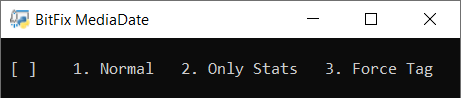

# BitFix MediaDate
I keep my personal media in a single folder and try to keep the collection from becoming too dense during some dates. To assist with this, MediaDate enforces the naming standard (YYYY-MM-DD HH.MM.SS.EXT) and displays the number of files included in the collection from each month as well as the days with the most files (top 10). A manual location-tagging system is also implemented to add information to the file name. Below you'll find an example of the naming standard being enforced.

Before | After
:-:|:-:
 | 

In this limited demonstration, 5 files didn't contain any valid date in image-metadata nor file name, and thus they're named using the files last modified date. This is marked with a single apostrophe, as it is the least reliable of the three date sources being considered. The following is the stats display that I use when looking for dates that could be made more sparse.

Stats from the before-after example | Stats from my media collection
:-:|:-:
 | 

The collection includes 4343 files and out of those I have only used 213 unique tags to assign location. A single file seems to only include a valid date and not a valid time in the file name, which is noted by the "No time" counter. The goal isn't an even distribution of files, but a collection which is sparse enough for me to enjoyably browse. MediaDate currently has three modes of operation presented in the starting menu seen below. Mode 1 renames and displays stats while 2 only does the latter and 3 applies the given suffix to all files in the current folder.

